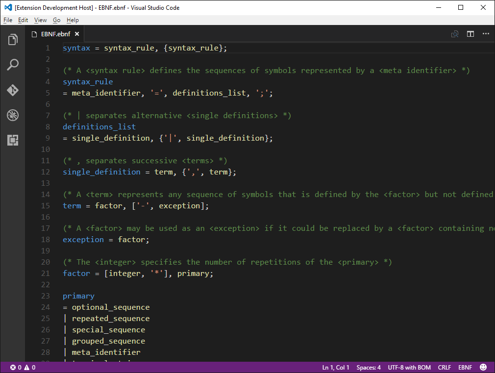
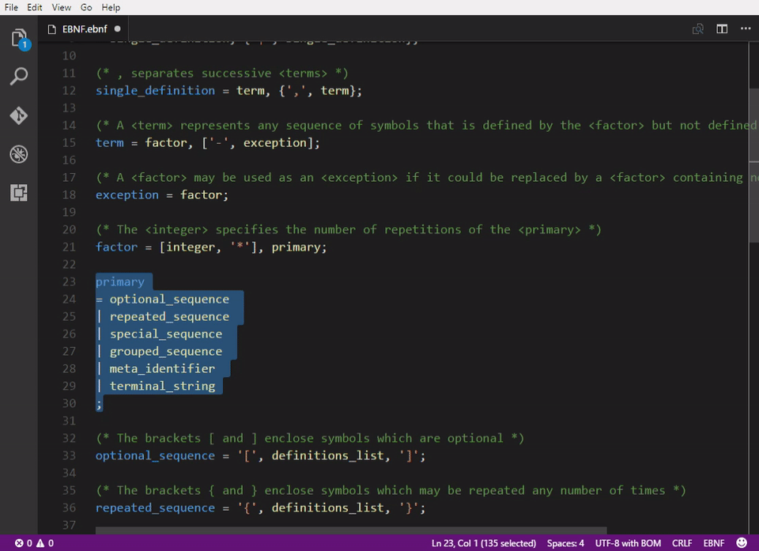

# EBNF Tools for Visual Studio Code

The EBNF Tools adds language support for the [EBNF](https://en.wikipedia.org/wiki/Extended_Backus%E2%80%93Naur_Form) syntax notation to Visual Studio Code. 

See the [changelog](CHANGELOG.md) for changes and roadmap.

## Features

- Syntax highlighting
- Commenting blocks of code
- Brace matching

### Syntax highlighting

### Commenting blocks of code

### Brace matching

## Contribute
Check out the [contribution guidelines](CONTRIBUTING.md)
if you want to contribute to this project.

## License
[Apache 2.0](LICENSE)